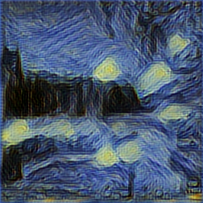
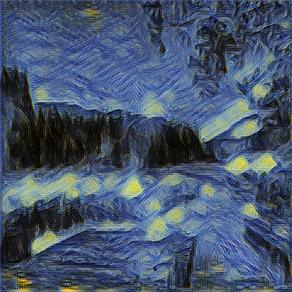
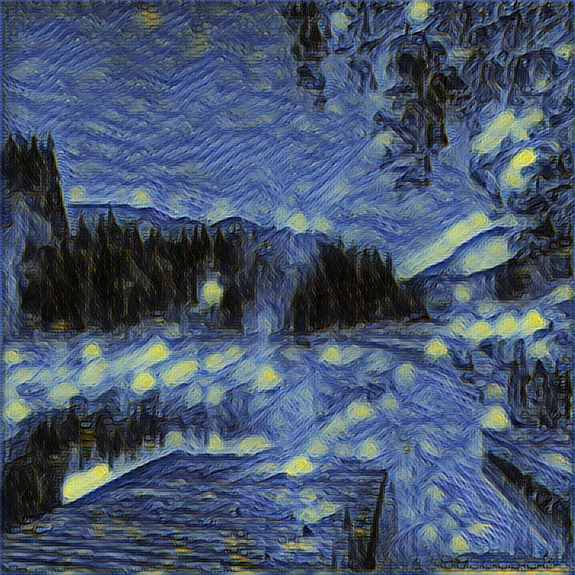
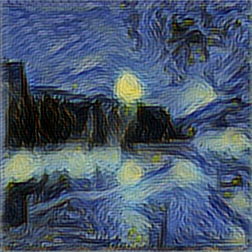
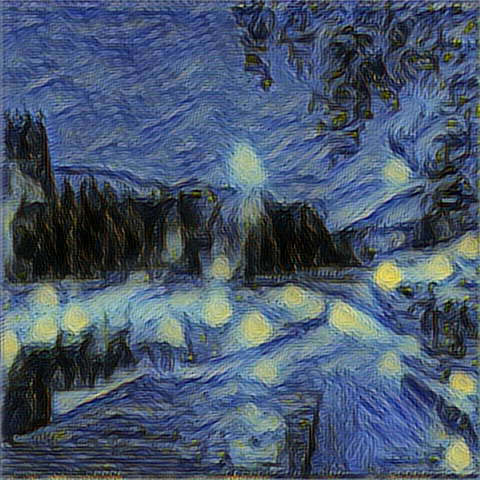

# Vangogh Crazy World - Web Practice

Here is the practice about how to make models that are trained by python code in <a href="https://github.com/acerwebai/VangoghCrazyWorld"> VangoghCrazyWorld</a>. 
It's implemented by ML5.js and P5.js.  
ML5.js is a high end API base on TensorFlow.js that published by Google.
You can get mode details from the <a href="https://ml5js.org/">ML5.js web</a> and <a href="https://www.tensorflow.org/js/">tensorflow.js web </a>
 
Following describes what is the steps that we need to do step by step. Enjoy it.

## Convert models
 After trained your own model by the python code in <a href="https://github.com/acerwebai/VangoghCrazyWorld"> VangoghCrazyWorld</a> that we modified from the code <a href="https://github.com/lengstrom/fast-style-transfer"> published by lengstrom</a>. 
 git clone the code from <a href="https://github.com/reiinakano/fast-style-transfer-deeplearnjs"> fast-style-transfer-deeplearnjs</a> 
 Following below instructions to convert TensorFlow checkpoint files to ML5 supported variable files.
 <pre>
 $ python scripts/dump_checkpoint_vars.py --output_dir=src/ckpts/my-new-style --checkpoint_file=/path/to/model.ckpt
 $ python scripts/remove_optimizer_variables.py --output_dir=src/ckpts/my-new-style
 </pre>
 
## Inference performance adjustment
To get a more efficent inference time on web experience. Reducing the model size is necessary.  
We modify the initial value of num_filter when we training tensorflow models. To get the enough quality and acceptable inference performance, we do some experiments, and get following benchmark table.
<table>
 <tr>
  <td>num filters  inference time(ms)</td><td>Intel UHD 620 4G VRAM (250x250) </td><td>Intel UHD 620 4G VRAM (480X480)</td><td>Intel UHD 620 4G VRAM (720X720)</tr>
 <tr><td> 4 num filter</td><td>130ms </td><td>270ms </td><td>540ms </td> 
 </tr>
 <tr><td> 8 num filter</td><td>200ms </td><td bgcolor="ffff00">600ms </td><td>WebGL context lost</td> 
 </tr>
 <tr><td> 16 num filter</td><td>600ms </td><td>WebGL context lost</td><td>WebGL context lost</td> 
 </tr>
 <tr><td> 32 num filter</td><td>1710ms </td><td>WebGL context lost</td><td>WebGL context lost</td> 
 </tr>
 </table>
As the benchmark table, we think the result of 8 num_filter and the input image with 480x480 dimension is acceptable.  
No matter inference time per frame or output quality on web experience, it get a comfortable result.
Therefore, we adjust the initial num filter to 8 from 32 that default in python code of <a href="https://github.com/lengstrom/fast-style-transfer"> published by lengstrom</a> for training models.
 

## ML5.js library adjustment
The original ML5.js library is limit the initial num filter as 32. To support our modified models, we need revise the ml5.min.js library. 
First, get the latest library source from ML5.js library github. 
Here is the change we did in the library. 
1. input dimension for video: 200x200 -> 480x480 
modify index.js of StyleTransfer in ML5.js library
<pre>
const IMAGE_SIZE = 200;
</pre>
to 
<pre>
const IMAGE_SIZE = 480;
</pre>
2. fulfill initial num filter modification of trained models. 
modify index.js of StyleTransfer in ML5.js library
<pre>
      const convT1 = this.convTransposeLayer(res5, 64, 2, 39);
      const convT2 = this.convTransposeLayer(convT1, 32, 2, 42);
</pre>
to
<pre>
      const convT1 = this.convTransposeLayer(res5, 16, 2, 39);
      const convT2 = this.convTransposeLayer(convT1, 8, 2, 42);
</pre>
After revised the source code, following the instruction in  CONTRIBUTING.md to recompile the mini js files.

## Credits 
#### The authers of <a href="https://github.com/reiinakano/fast-style-transfer-deeplearnjs"> fast-style-transfer-deeplearnjs</a>
#### The authers of <a href="https://github.com/yining1023/fast_style_transfer_in_ML5/"> fast-style transfer-in-ML5</a>
#### The author of <a href="https://github.com/lengstrom/fast-style-transfer"> fast-style-transfer by tensorflow</a>
#### <a href="https://github.com/ml5js/ml5-library"> ML5.js Library github</a>

## License

This project is licensed under the MIT, see the [LICENSE.md](LICENSE)

